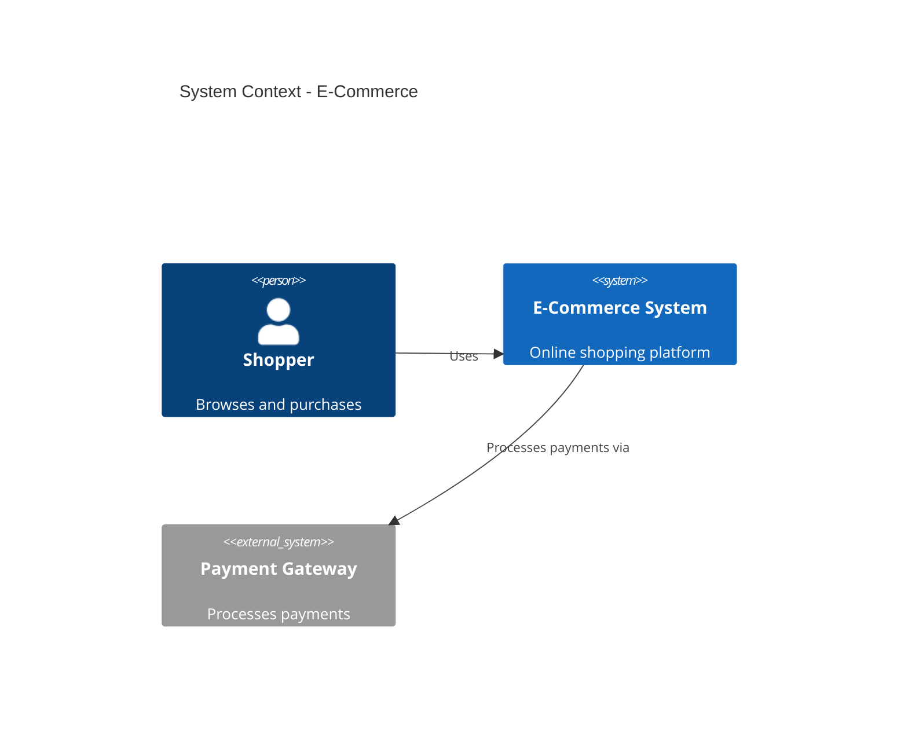

I've sat through architecture presentations where someone proudly unveils a diagram that looks like spaghetti had a fight with a circuit board. Boxes everywhere. Arrows crossing arrows. A database icon connected to something labeled "Kafka?" with a question mark. By slide three, half the room is checking Slack. The other half is nodding politely while having no idea what's being proposed.

The problem isn't that people can't draw. It's that most architecture diagrams try to show everything at once. Security boundaries, deployment topology, class relationships, and the CEO's favorite buzzword—all crammed into one canvas. Nobody wins.

That's why I reach for the [C4 model](https://c4model.com/) whenever I need to explain a system. Created by Simon Brown, C4 gives you four levels of abstraction—Context, Containers, Components, and Code—each with a specific audience and purpose. You zoom in when you need detail. You zoom out when you need the big picture. Simple idea. Massive impact on team alignment.

## Why Most Architecture Diagrams Fail

Before C4, my diagrams followed a predictable lifecycle:

1. Draw something comprehensive for the architecture review
2. Realize it's too detailed for executives
3. Draw a simplified version for executives
4. Realize developers need more detail
5. Draw another version for developers
6. All three diagrams drift out of sync within a month
7. New hire asks "which diagram is current?" Everyone shrugs

Sound familiar? The C4 model fixes this by making **multiple views intentional**, not accidental. Each level answers a different question:

| Level | Question it answers | Primary audience |
|-------|---------------------|------------------|
| Context | What is this system, and who uses it? | Everyone |
| Containers | What are the major building blocks? | Technical leads, architects |
| Components | What's inside each container? | Developers |
| Code | How is it implemented? | Developers (when needed) |

You don't show all four levels in every meeting. You pick the right zoom level for the room.

## Level 1: System Context — The Elevator Pitch

The context diagram is the one diagram everyone should understand—including product managers, executives, and that one stakeholder who "just wants to see the architecture."

It shows:
- Your system (one box—yes, just one)
- Users and personas who interact with it
- External systems you depend on or that depend on you

No databases. No internal services. No Kubernetes. If you can't explain your system at this level in 30 seconds, you don't understand it well enough yet.

```
┌─────────┐     ┌─────────┐
│  Shopper│     │  Admin  │
└────┬────┘     └────┬────┘
     │               │
     │  Uses         │  Manages
     │               │
┌────▼───────────────▼────┐
│     E-Commerce System   │
└────┬──────────┬─────────┘
     │          │
     │          │ Sends receipts
     │          │
┌────▼────┐  ┌──▼─────┐
│ Payment │  │ Email  │
│ Gateway │  │ Service│
└─────────┘  └────────┘
```

**Real-world tip:** I label arrows with verbs. "Uses," "Pays via," "Sends events to." Passive arrows are where ambiguity hides.

When I present context diagrams, I watch for the moment someone says "Oh, *that's* what we're building." That moment means the diagram worked.

## Level 2: Container Diagram — The Technical Overview

Once people understand *what* the system does, they want to know *how* it's built. The container diagram shows the high-level technology choices and communication patterns.

In C4 terminology, a "container" isn't Docker—it's an application, a database, a message queue, a mobile app. Anything that runs or stores data.

```
┌─────────────────────────────────────────────┐
│              E-Commerce System              │
│                                             │
│  ┌─────────────┐      ┌─────────────┐      │
│  │   Web App   │      │  Mobile App │      │
│  │   [React]   │      │   [Swift]   │      │
│  └──────┬──────┘      └──────┬──────┘      │
│         │                    │             │
│         └────────┬───────────┘             │
│                  │ HTTPS/JSON               │
│         ┌────────▼────────┐                │
│         │   API Gateway   │                │
│         │    [Kong]       │                │
│         └────────┬────────┘                │
│                  │                         │
│    ┌─────────────┼─────────────┐           │
│    │             │             │           │
│ ┌──▼──┐      ┌───▼───┐    ┌───▼───┐       │
│ │Auth │      │ Order │    │Catalog│       │
│ │ Svc │      │  Svc  │    │  Svc  │       │
│ │[Go] │      │[Java] │    │[Go]   │       │
│ └──┬──┘      └───┬───┘    └───┬───┘       │
│    │             │            │           │
│ ┌──▼──┐      ┌───▼───┐    ┌───▼───┐       │
│ │Postg│      │ Redis │    │  SQS  │       │
│ │res  │      │       │    │       │       │
│ └─────┘      └───────┘    └───────┘       │
└─────────────────────────────────────────────┘
```

Notice what changed from Level 1: we opened the "E-Commerce System" box and showed what's inside. We added technology labels in brackets. We showed protocols on arrows.

This is the diagram I use in architecture reviews, onboarding sessions, and "here's what we're proposing to build" discussions. It's detailed enough to be useful, abstract enough to fit on one slide.

## Level 3: Component Diagram — Inside the Box

When a team owns a specific container—say, the Order Service—you drill into its internal structure. The component diagram shows the major modules, their responsibilities, and how they interact.

```
┌─────────────────────────────────────────┐
│            Order Service [Java]         │
│                                         │
│  ┌──────────────┐    ┌──────────────┐  │
│  │   REST API   │───▶│ Order        │  │
│  │  Controller  │    │ Controller   │  │
│  └──────────────┘    └──────┬───────┘  │
│                             │          │
│              ┌──────────────┼──────┐   │
│              │              │      │   │
│       ┌──────▼─────┐ ┌──────▼────┐ │   │
│       │  Pricing   │ │ Inventory │ │   │
│       │  Service   │ │  Service  │ │   │
│       └────────────┘ └───────────┘ │   │
│                             │      │   │
│                      ┌──────▼──────┐│   │
│                      │   Order     ││   │
│                      │ Repository  ││   │
│                      └─────────────┘│   │
└─────────────────────────────────────────┘
```

I only create component diagrams for containers that are complex enough to warrant them. A simple CRUD service with three endpoints? Skip it. A service with intricate business logic, multiple integrations, and a team of eight developers? Definitely worth a component diagram.

## Level 4: Code Diagram — Use Sparingly

The code level shows classes, interfaces, and their relationships—essentially UML class diagrams. Simon Brown's advice, which I follow religiously: **auto-generate these from your IDE, don't hand-draw them.**

Hand-drawn code diagrams go stale before the ink dries. Your IDE knows the actual structure. Let it generate the diagram when someone needs implementation-level detail.

I reach for Level 4 only when:
- Onboarding a developer into a complex module
- Discussing a specific refactoring
- Documenting a tricky design pattern in the codebase

For everything else, Level 3 is enough.

## Putting C4 Into Practice

Here's my workflow for documenting a new system:

### Step 1: Start with Context (Always)

Before writing code, before choosing technologies, before debating microservices vs. monolith—I draw the context diagram. If I can't draw it, I don't understand the problem space yet.

Questions I ask:
- Who uses this system?
- What external systems do we integrate with?
- What's in scope vs. out of scope?

### Step 2: Add Containers When Design Solidifies

Once we've chosen the major technology blocks, I create the container diagram. This is where debates about "should auth be its own service?" become visible and discussable.

### Step 3: Component Diagrams for Complex Services Only

Not every service gets a component diagram. I use a simple heuristic: if explaining the internal structure takes more than five minutes verbally, it needs a diagram.

### Step 4: Link to Architecture Decision Records

Each significant decision gets an ADR. The C4 diagrams link to ADRs. The ADRs link back to diagrams. Future you—and future teammates—will thank present you.

```markdown
# ADR-007: Extract Order Service from Monolith

## Status
Accepted

## Context
See: [Container Diagram - E-Commerce System](../architecture/container-diagram.md)

## Decision
Extract order processing into a standalone Java service...

## Consequences
- New deployment pipeline required
- Database split needed (see ADR-008)
```

## Tools That Make C4 Easier

You don't need fancy tools to start—pen and paper work fine for early thinking. For maintainable diagrams, I use:

**[Structurizr](https://structurizr.com/)** — Simon Brown's own tool. Define diagrams as code, generate consistent views. The "diagrams as code" approach means diagrams live in version control alongside your application.

```javascript
// Structurizr DSL example
workspace {
    model {
        user = person "Shopper"
        ecommerce = softwareSystem "E-Commerce System" {
            webApp = container "Web App" "React SPA" "React"
            api = container "API Gateway" "Routes requests" "Kong"
            orderSvc = container "Order Service" "Processes orders" "Java"
        }
        payment = softwareSystem "Payment Gateway" "External"
        
        user -> webApp "Uses"
        webApp -> api "API calls"
        api -> orderSvc "Routes to"
        orderSvc -> payment "Processes payments via"
    }
}
```

**Draw.io / diagrams.net** — Free, integrates with Confluence and Google Drive. Good for quick diagrams that don't need to be code-generated.

**PlantUML with C4 extensions** — If your team already uses PlantUML, the [C4-PlantUML](https://github.com/plantuml-stdlib/C4-PlantUML) library works well.

**Mermaid** — For embedding diagrams directly in Markdown docs:



## Common Mistakes (I've Made All of These)

**Showing too much detail too soon.** New engineers love diving into component diagrams before stakeholders agree on the context. Resist. Get buy-in at Level 1 first.

**Inconsistent notation.** Pick a symbol set and stick with it. Mixing UML, ArchiMate, and random clipart confuses everyone.

**Diagrams that never update.** A wrong diagram is worse than no diagram—it actively misleads. If you can't commit to maintaining it, don't create it. Diagrams as code help here because they break the build when they're wrong (if you CI-check them).

**No legend.** If your diagram uses colors or dashed lines, explain what they mean. Obvious to you isn't obvious to the new hire.

**Creating diagrams in isolation.** The best architecture diagrams come from collaborative sessions. Whiteboard with the team, then formalize. Solo diagrams miss nuance.

## C4 vs. Other Approaches

People ask how C4 compares to other architecture documentation approaches:

**vs. UML:** UML is comprehensive but heavyweight. C4 is a subset focused on structural views. Use UML when you need sequence diagrams, state machines, or detailed class relationships. Use C4 for system structure.

**vs. Arc42:** Arc42 is a template for architecture documentation. C4 provides the diagram types. They complement each other—use Arc42 sections with C4 diagrams inside.

**vs. "Just write ADRs":** ADRs capture decisions. C4 captures structure. You need both. ADRs without diagrams lack context. Diagrams without ADRs lack rationale.

## When C4 Isn't Enough

C4 excels at structural views—what connects to what. It doesn't cover:
- **Deployment views** — Where containers run (use deployment diagrams)
- **Dynamic behavior** — Request flows over time (use sequence diagrams)
- **Data models** — Entity relationships (use ER diagrams)

Add these as supplementary views when needed. C4 doesn't replace them; it provides the foundation.

## Conclusion

Good architecture documentation isn't about creating beautiful diagrams—it's about creating *useful* diagrams that help teams make decisions and onboard quickly. The C4 model gives you a structured way to do that without drowning people in detail.

Start with context. Always start with context. If executives and product managers understand Level 1, you've built the foundation for everything else. Add container diagrams when your technical design solidifies. Component diagrams for complex services. Code diagrams only when auto-generated.

The next time someone asks "can you explain the architecture?", you'll have four zoom levels ready. And nobody will need to check Slack to survive the presentation.

**Further Resources:**
- [C4 Model Official Site](https://c4model.com/) — Simon Brown's comprehensive guide
- [Structurizr](https://structurizr.com/) — Diagrams as code
- [C4-PlantUML](https://github.com/plantuml-stdlib/C4-PlantUML) — PlantUML integration
- [Arc42 Template](https://arc42.org/) — Architecture documentation template
- [Architecture Decision Records](https://adr.github.io/) — Documenting decisions

---

*C4 Model from January 2022, covering architecture visualization.*
